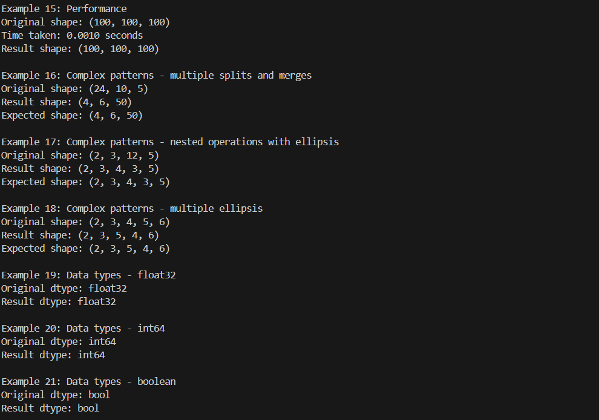

# Einops Modified Implementation

## Overview
In this project, I have implemented a modified version of the einops tensor manipulation library, focusing on numpy array operations. The implementation provides a flexible way to manipulate tensor dimensions using a simple string-based syntax inspired by Einstein notation.

## Table of Contents
- [Implementation Approach](#implementation-approach)
- [Design Decisions](#design-decisions)
- [Features](#features)
- [Installation](#installation)
- [Usage](#usage)
- [Testing](#testing)
- [Implementation Details](#implementation-details)
- [Examples](#examples)
- [Performance Considerations](#performance-considerations-i-made-while-implementing-the-function)
- [Future Improvements](#future-improvements)

## Implementation Approach
I approached this implementation with a focus on readability, maintainability, and performance. The core functionality is built around the `rearrange` function, which parses pattern strings and performs tensor manipulations. Here's a high-level overview of my approach:

1. **Pattern Parsing**: Implemented a robust parser with LRU caching for efficient pattern string interpretation
2. **Error Handling**: Created custom exception classes for detailed error messages
3. **Memory Management**: Added memory usage estimation to prevent OOM errors
4. **Testing**: Developed comprehensive test suite covering basic operations to edge cases

### Implementation Flowchart
#### Visual Representation


```
Input Pattern String
       ↓
Pattern Parsing (LRU Cached)
       ↓
Validate Input Shape
       ↓
Memory Usage Check
       ↓
Apply Operations:
  ├→ Basic Transpose
  ├→ Split Axes
  ├→ Merge Axes
  ├→ Handle Ellipsis
  └→ Repeat Axes
       ↓
Return Result
```

## Design Decisions

### 1. Pattern String Format
- Used space-separated dimensions for readability
- Implemented parentheses for grouping dimensions
- Added ellipsis (...) support for batch dimensions
- Example: `'(h w) c -> h w c'`

### 2. Error Handling
Created specific exception classes:
```python
class EinopsError(Exception): pass
class PatternError(EinopsError): pass
class ShapeError(EinopsError): pass
class MemoryError(EinopsError): pass
class DimensionError(EinopsError): pass
```

### 3. Performance Optimizations
- LRU caching for pattern parsing
- Memory usage estimation
- Minimal intermediate tensor operations

## Features
- Basic tensor operations (reshape, transpose)
- Axis splitting and merging
- Axis repetition
- Batch dimension handling
- Memory usage control
- Comprehensive error checking
- Data type preservation

## Installation
This implementation is provided as a Google Colab notebook. To use it:

1. Open the notebook in Google Colab
2. Run the implementation cell
3. Use the functions in subsequent cells

## Usage

### Basic Operations - You can play around with all 25 examples in the Google Colab Notebook!
```python
# Transpose
result = rearrange(x, 'h w -> w h')

# Split an axis
result = rearrange(x, '(h w) c -> h w c', h=3)

# Merge axes
result = rearrange(x, 'a b c -> (a b) c')

# Handle batch dimensions
result = rearrange(x, '... h w -> ... (h w)')
```

### Terminal Output


## Testing
The implementation includes comprehensive tests covering:

1. Basic Operations
   - Transpose operations
   - Axis splitting
   - Axis merging
   - Repetition

2. Complex Transformations
   - Multiple operations
   - Batch dimensions
   - Nested operations

3. Error Cases
   - Invalid patterns
   - Shape mismatches
   - Memory limits
   - Nested parentheses

4. Edge Cases
   - Empty tensors
   - Single dimensions
   - Zero dimensions
   - Large dimensions

5. Performance Tests
   - Execution time
   - Memory usage

6. Data Type Tests
   - float32
   - int64
   - boolean

### Test Output Usage Examples





## Implementation Details

### Core Components
1. **Pattern Parser**
   - Handles input/output patterns
   - Validates syntax
   - Extracts dimension information

2. **Shape Validator**
   - Checks dimension compatibility
   - Validates axis lengths
   - Handles ellipsis expansion

3. **Memory Manager**
   - Estimates memory requirements
   - Prevents excessive memory usage
   - Manages tensor operations efficiently

## Examples
The implementation includes 25 comprehensive examples demonstrating various features:

1. Basic transpose operations
2. Axis splitting and merging
3. Complex pattern handling
4. Error cases
5. Edge cases
6. Performance tests
7. Data type preservation

#### These 25 examples are displayed in the images above 

## Performance Considerations I made while implementing the function
- Pattern parsing is cached using LRU cache
- Memory usage is estimated before operations
- Intermediate tensor operations are minimized
- Large tensor operations are protected against OOM


## Future Improvements
1. Support for nested parentheses
2. Dynamic memory limit adjustment
3. Additional optimization for large tensors
4. Support for more complex patterns
5. Integration with other array libraries


## Author
Nandita Nandakumar,
Machine Learning Engineer, Atmos
---
